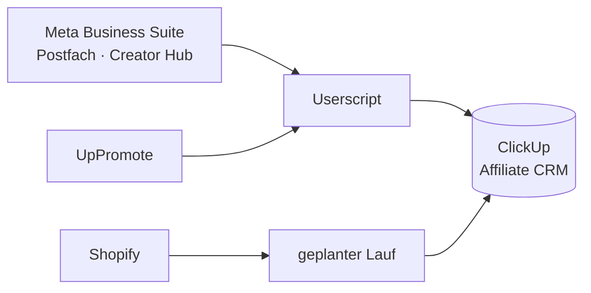

# Postfach-Markierungen & Creator-Marketplace-Links

Zwei Tampermonkey-Userscripts für die **Meta Business Suite**. Sie markieren
Unterhaltungen im Partner-Postfach, verbinden sie mit einer Pipeline in
**ClickUp** und ziehen Signale aus **UpPromote**, Metas **Creator Marketing
Hub** und **Shopify** nach.

Kein Server, keine Datenbank. Alles läuft im Browser.



---

## Dokumentation

| | |
|---|---|
| **[Bedienung](docs/bedienung.md)** | Wie man damit arbeitet: Markierungen, der Aktualisieren-Knopf, die Status-Pipeline, Fehlersuche. |
| **[Entwicklung](docs/entwicklung.md)** | Wie es verdrahtet ist, warum es so gebaut ist — und die **Einrichtung**. |

---

## Die Skripte

| Datei | Zweck |
|---|---|
| [`postfach-markierungen.user.js`](postfach-markierungen.user.js) | Kernskript: Markierungen, ClickUp, UpPromote, Content |
| [`creator-marketplace-links.user.js`](creator-marketplace-links.user.js) | Pille „zum Insta-Profil" im Creator Marketplace |
| [`postfach-lader.user.js`](postfach-lader.user.js) | **Zurückgestellt, nicht installieren** — siehe Entwicklerdoku, Abschnitt 9 |

Installation über die Rohadressen; beide Skripte aktualisieren sich danach
selbst. Die ausführliche Anleitung samt Chrome- und ClickUp-Einstellungen
steht in der [Entwicklerdoku](docs/entwicklung.md#8-einrichtung).

---

## Tests

```bash
node tests/postfach.test.mjs
node tests/lader.test.mjs
```

jsdom mit nachgebauten GM-Funktionen und API-Antworten. Keine echten Anfragen,
keine echten Zugangsdaten.

---

## Hinweis

Dieses Repository ist öffentlich. Zugangsdaten liegen ausschließlich im
Tampermonkey-Speicher des jeweiligen Browsers und gehören niemals in den Code.
Alle IDs, Namen und Adressen in Beispielen und Tests sind erfunden.
