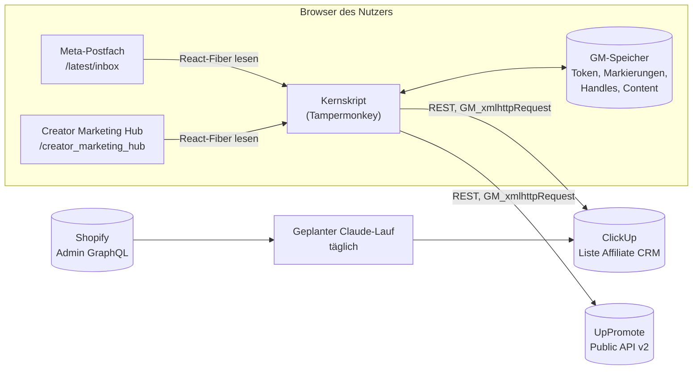
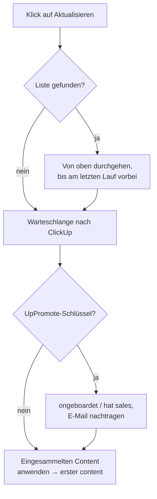

# Entwicklerdokumentation

Wie die Teile zusammenhängen, warum sie so gebaut sind, und wie man die
Umgebung aufsetzt.

Die Bedienung steht in [bedienung.md](bedienung.md).

---

## 1. Was das Ganze ist

Zwei Tampermonkey-Userscripts, die in der Meta Business Suite laufen und eine
Affiliate-Pipeline in ClickUp pflegen. Kein Server, keine Datenbank, keine
Erweiterung — alles passiert im Browser des Nutzers.

| Datei | Zweck |
|---|---|
| `postfach-markierungen.user.js` | Das Kernskript. Markierungen im Postfach, ClickUp-Anbindung, UpPromote, Content-Auswertung. |
| `creator-marketplace-links.user.js` | Blendet im Creator Marketplace eine Pille „zum Insta-Profil" ein. Eigenständig, kennt ClickUp nicht. |
| `postfach-lader.user.js` | **Zurückgestellt, nicht installieren.** Siehe Abschnitt 9. |

---

## 2. Verdrahtung



Der entscheidende Punkt: **Shopify hängt bewusst nicht am Skript.** Ein
Shopify-Admin-Token im Browser läse den kompletten Kundenstamm. Stattdessen
holt ein geplanter Claude-Lauf die Daten und schreibt sie nach ClickUp, mit
Zugängen, die ohnehin außerhalb des Browsers liegen.

---

## 3. Woher welches Signal kommt

| Signal | Quelle | Feld / Merkmal | Wer holt es |
|---|---|---|---|
| Unterhaltung, Titel, Datum | Meta-Postfach | React-Fiber, `thread` | Kernskript |
| Wer zuletzt schrieb | Meta-Postfach | Snippet beginnt mit `Du: ` | Kernskript |
| Instagram-Handle | Marketplace, Kontaktkarte, Vorschautext | Text | Kernskript |
| Onboarding | UpPromote | `GET /affiliates?status=active` | Kernskript |
| Sales | UpPromote | `approved_ + pending_ + paid_amount` | Kernskript |
| E-Mail des Affiliates | UpPromote | `email` | Kernskript |
| Nutzbarer Content | Creator Marketing Hub | React-Fiber, `content.ad_ready_status` | Kernskript |
| Warensendung | Shopify | Bestellung mit Tag `uppromote_gift` **oder** `Affiliate`, 0,00 € | Geplanter Lauf |
| Nachfass-Frist | abgeleitet | spätere aus „letzte Nachricht + 14 Tage" und „Versand + 10 Wochentage" | Skript, ersatzweise geplanter Lauf |
| Tag `ad-code` | Creator Marketing Hub | einmal nutzbarer Content gesehen | Skript |

### UpPromote

Basis `https://aff-api.uppromote.com/api/v2`, Schlüssel im Header
`Authorization`. 120 Anfragen pro Minute und Shop.

Es gibt **keinen Gifts-Endpunkt** — die Bereiche sind Programs, Affiliates,
Coupons, Payments, Referrals, Analytics, Webhooks. Warensendungen sind deshalb
nur über Shopify zu bekommen.

`upAktive()` blättert mit `per_page=100&page=N` und bricht ab, sobald eine Seite
dieselben Einträge liefert wie die vorige. Ohne diese Schranke lief die
Schleife bis zum Seitenlimit, falls UpPromote `page` ignoriert — einmal über
sechs Minuten ohne jedes Lebenszeichen.

### Creator Marketing Hub

Seite `/creator_marketing_hub/ad_content/`. Jede Kachel trägt am React-Fiber
ein `content`-Objekt. **Maßgeblich ist `ad_ready_status`, nicht
`pa_content_type`** — Berechtigung und Content-Art sind unabhängige Achsen, es
gibt UGC mit Rechten und Branded Content ohne.

| Metas Filter | `ad_ready_status` | Bedeutung |
|---|---|---|
| Für Anzeige bereit | `NO_ISSUES` | Rechte liegen vor |
| Handeln erforderlich | `WARNINGS` | keine Berechtigung, aber anfragbar |
| Unzulässig | nie beobachtet | nicht nutzbar |

Gezählt wird als **Positivliste** (`NO_ISSUES` oder `WARNINGS`), damit der
dritte Wert nie versehentlich mitzählt.

Zwei Parameter gehören zwingend in die Adresse:

- `sort_index=upac_publish_time` — ohne Datumssortierung zeigt Meta nach
  Relevanz vor allem fremde Creator
- `business_id` und `asset_id` — ohne sie landet Meta auf dem zuletzt
  benutzten Konto. Das Skript übernimmt beide aus der Adresse des Postfachs,
  statt sie fest zu verdrahten.

### Shopify

Warensendungen sehen in Shopify auf **zwei** Arten aus, je nach Zeitraum:

| Zeitraum | Tag | Entstehung |
|---|---|---|
| seit 06.08.2026 | `uppromote_gift` | UpPromote legt sie an, wenn der Affiliate sein Geschenk einlöst |
| davor, ca. 08.05.–02.09.2026 | `Affiliate` | von Hand als Entwurfsbestellung erfasst |

Beide haben Gesamtwert 0,00 €.

```graphql
orders(query: "tag:uppromote_gift OR tag:Affiliate") {
  name  createdAt  email  tags  displayFulfillmentStatus
  totalPriceSet { shopMoney { amount } }
}
```

Behalten wird nur, was **0,00 €** kostet und auf `FULFILLED` oder
`PARTIALLY_FULFILLED` steht — nur das ist wirklich raus. Bei mehreren
Bestellungen zu einer Adresse zählt die älteste. Zugeordnet wird
**ausschließlich über exakte E-Mail-Übereinstimmung**, nie über
Namensähnlichkeit.

#### Nachfass-Frist

Das Fälligkeitsdatum des Tasks ist die Deadline zum Nachhaken. Es gelten zwei
Regeln, und zwar **die spätere von beiden**:

- **14 Tage nach der letzten Nachricht oder Reaktion des Creators**
- **10 Wochentage nach dem Versand der Ware**, falls es einen gibt — gezählt ab
  dem Tag nach dem Versand, Samstag und Sonntag übersprungen, Feiertage
  unberücksichtigt

Kontrollbeispiel: Versand Freitag 31.07.2026 → Frist Freitag 14.08.2026.

> **Warum „die spätere" nicht nur sinnvoll, sondern nötig ist.**
> Das `start_date` trägt bei uns das Datum der letzten Nachricht, und **ClickUp
> lehnt ein Startdatum nach dem Fälligkeitsdatum ab** („Start date cannot be
> after due date"). Eine reine Versandfrist lag bei laufenden Unterhaltungen
> irgendwann vor der letzten Nachricht — ab da scheiterte jedes weitere
> Schreiben mit Fehler 400, und weil sich das Skript das Datum erst nach
> erfolgreichem Schreiben merkt, stellte es den Auftrag bei jedem Durchlauf
> neu ein. Dauerschleife.
>
> Die 14-Tage-Regel schließt das von selbst aus: eine Frist 14 Tage nach der
> letzten Nachricht liegt nie davor. Zusätzlich gehen Startdatum und Frist in
> **einer** Anfrage raus, nie einzeln.
>
> Die „Duration ClickApp", die ClickUp in der Fehlermeldung vorschlägt, wäre
> der falsche Weg: sie würde eines der beiden Daten selbsttätig verschieben und
> damit genau die Bedeutung zerstören, die wir hineinlegen.

Zuständig ist in erster Linie das Skript — es sieht bei jedem Durchlauf jede
sichtbare Unterhaltung. Der geplante Shopify-Lauf setzt eine Frist nur, wenn
noch gar keine da ist, für Tasks, deren Unterhaltung das Skript nicht zu
Gesicht bekommen hat. Ein von Hand gesetztes Datum bleibt in beiden Fällen
unangetastet.

#### Kein neuer Task ohne Handle

Weil ein Task ohne Handle für jede Automatik unsichtbar ist, wird der Handle
beim Anlegen aktiv beschafft — in drei Stufen.

**Stufe 1, Kontaktkarte.** Markiert jemand eine Unterhaltung, zu der kein
Handle bekannt ist, öffnet das Skript sie und liest die Kontaktkarte aus. Das
ist die einzige zweifelsfreie Quelle: dort steht das Profil der Person, mit der
tatsächlich geschrieben wird. Bis zu fünf Sekunden wird gewartet, dann gibt es
auf.

**Stufe 2, Nachfrage.** Gibt die Karte nichts her — es gibt nicht zu jeder
Unterhaltung eine —, erscheint ein Kasten mit Eingabefeld, einem Link nach
Instagram und dem Ausgang „Später nachtragen".

**Stufe 3, Werkbank.** Im Panel listet der Abschnitt „Handles nachtragen" alle
Tasks ohne Handle, jeweils mit Eingabefeld. An der Pille steht zusätzlich
„N ohne Handle".

> **Warum nicht einfach das Anlegen verweigern?**
> Weil die Markierung dann trotzdem bestünde — nur noch lokal im Browser. Der
> Datensatz wäre nicht mehr in ClickUp unvollständig, sondern für Cosima
> überhaupt nicht vorhanden. Das Anlegen läuft deshalb immer durch; der Handle
> kommt nach.

**Einwortige Namen gelten nur klein geschrieben als Handle.** `naturpedal` und
`hansj.stolz` sind Handles, `Willi` und `Sophie` sind Vornamen. Ohne diese
Schranke hielt `handleAusTaskname` jeden einwortigen Anzeigenamen für einen
Handle, machte daraus kleingeschrieben einen Suchschlüssel und nahm solche
Tasks aus der Lücken-Erkennung heraus — sie galten als versorgt, obwohl der
Handle geraten war.

#### Der Tag `ad-code`

Sobald zu einem Creator zum ersten Mal nutzbarer Content gesehen wurde, bekommt
sein Task den Tag **`ad-code`**. Anders als der Status bleibt er stehen, auch
wenn der Task weiterwandert — er hält eine Tatsache fest, keinen Zustand. Es
gibt deshalb kein Entfernen, und er wird auch dann gesetzt, wenn der Status
wegen der Leiter nicht mehr geändert wird.

> Die erste Fassung suchte nur nach `uppromote_gift` und übersah damit über
> hundert Altfälle aus der Handarbeits-Zeit — aufgefallen an einem Affiliate,
> dessen Paket nachweislich raus war und der trotzdem auf `ongeboardet` stand.
> Beim Erweitern solcher Filter lohnt die Gegenprobe ohne Filter.

---

### Affiliates aus UpPromote importieren

Knopf „Affiliates importieren" im Panel. Holt alle **aktiven** Affiliates des
Programms `TZAMPAS Affiliate Programm` und legt die an, die noch fehlen.

**Erster Klick zählt nur**, zweiter legt an. Bei über hundert Datensätzen will
man vorher sehen, was passiert. Die Vorschau verfällt nach fünf Minuten.

Als „schon vorhanden" gilt, wer über **Handle oder E-Mail** zu einem
bestehenden Task passt. Tasks ohne Handle und ohne `igfu-mail` sind damit nicht
erkennbar — die würden doppelt angelegt. Vor einem Import also erst die Lücken
füllen.

Neue Tasks bekommen Titel `handle — Name`, Status nach der Leiter
(`ongeboardet`, bei Provision `hat sales`), die Instagram-Zeile und die Marker
`igfu-handle` und `igfu-mail`. Ohne Handle zusätzlich den Tag `handle-fehlt`.

**Der Unterhaltungs-Link lässt sich nicht aus dem Handle bauen.**
`selected_item_id` ist Metas interne, 39-stellige Unterhaltungs-ID; der Handle
kommt darin nicht vor und es gibt keine Rechenvorschrift. Der Link kann nur
gesetzt werden, wenn das Skript die Unterhaltung schon einmal gesehen hat —
`threadZuHandle()` schlägt im GM-Speicher nach. Viele Affiliates wurden nie
über das Partner-Postfach angeworben und haben schlicht keine.

### Notizen aus UpPromote

Zwei Felder am Affiliate werden als **ClickUp-Kommentar** übernommen, getrennt
beschriftet:

- `internal_note` — was ihr über den Affiliate notiert habt
- `personal_detail` — was der Affiliate selbst angegeben hat

Das passiert im UpPromote-Abgleich, also für **alle** passenden Tasks, nicht
nur für frisch importierte.

**Gegen Doppelungen** steht eine Kurzprüfsumme der Notiz als Markerzeile
`igfu-notiz` in der Beschreibung — bewusst dort und nicht im GM-Speicher, denn
der ist pro Browser: sonst postet der Mac, was Windows schon gepostet hat.
Ändert sich die Notiz, ändert sich die Prüfsumme und es kommt ein **neuer**
Kommentar dazu; der alte bleibt stehen, weil ein Verlauf hier nützlicher ist
als stilles Überschreiben.

Die Sperre liegt doppelt: einmal als Filter in `upAbgleichen`, einmal in
`notizUebertragen`. Ein Mutationstest, der nur eine davon entfernt, bleibt
deshalb wirkungslos — erst wenn beide fallen, kommt der Kommentar zweimal.

### Nachträglich verbinden

Wird später doch eine Unterhaltung angefangen, taucht sie im Postfach auf.
`scanRows` erkennt den Handle und verbindet sie über den Auftrag
`verbinden-handle` mit dem vorhandenen Task: Link und `igfu-thread` werden
nachgetragen, der Task wandert von `cuOhneThread` nach `cuTasks`. Ohne Zutun.

Das Anschreiben selbst ist **bewusst nicht automatisiert** — Nachrichten im
Namen des Nutzers verschickt das Skript nicht.

## 4. Die Brücke zwischen den Welten

Jedes System kennt den Affiliate unter einem anderen Schlüssel:

```
Meta-Postfach ──── threadID
Marketplace ────── Bild-ID des Profilfotos
ClickUp ────────── Handle im Task-Namen  ("handle — Anzeigename")
UpPromote ──────── Handle  +  E-Mail
Shopify ────────── E-Mail
```

Verbunden wird über Markerzeilen in der **Task-Beschreibung**:

```
igfu-thread: <threadID>     Unterhaltung ↔ Task
igfu-handle: <handle>       Task ↔ UpPromote, Content, Marketplace
igfu-bild:   <bildID>       im Marketplace erfasster Task ↔ Unterhaltung
igfu-mail:   <adresse>      Task ↔ Shopify-Bestellung
igfu-ware:   <JJJJ-MM-TT>   Versanddatum, vom geplanten Lauf gesetzt
                            (das Skript liest es für die Frist mit)
```

**Der Handle steht an zwei Stellen, und das mit Absicht.** Im Task-Namen, weil
man ihn dort sieht und danach suchen kann. Und als Markerzeile, weil die die
**maßgebliche Bezugsstelle** ist: `handleVonTask()` liest erst den Marker, erst
dann den Namen. Eine Umbenennung in ClickUp kann die Zuordnung damit nicht mehr
stillschweigend zerreißen.

### Wie ein importierter Task seine Unterhaltung findet

Aus UpPromote importierte Tasks haben beim Anlegen keine `igfu-thread`-Zeile,
weil mit den meisten dieser Affiliates nie über das Partner-Postfach geschrieben
wurde. Verbunden wird nachträglich, und zwar über zwei Wege in dieser Reihenfolge:

```
Unterhaltung im Postfach
        │
        ├── Handle bekannt?  ──ja──► Task mit gleichem igfu-handle   (verbinden-handle)
        │   (Vorschautext,
        │    Kontaktkarte)
        │
        └── nein ──► Anzeigename  ──► Task mit gleichem Namen        (Namensbrücke)
```

**Die Namensbrücke ist der Normalfall, nicht die Ausnahme.** Bei normalen
Instagram-DMs zeigt Meta in der Liste fast immer den Anzeigenamen und nirgends
den Handle — der Handle steht nur im Vorschautext („handle gefällt …") oder in
der Kontaktkarte der geöffneten Unterhaltung. Der Anzeigename dagegen ist genau
das, was bei einem importierten Task im Namen steht, weil er aus Vor- und
Nachnamen des Affiliates gebaut wurde.

Verglichen wird über `namensform()`: Kleinschreibung, Satzzeichen und Emoji
fallen weg, mehrfache Leerzeichen werden zu einem. Zwei Schranken verhindern,
dass geraten wird:

1. **Mindestens zwei Wortteile.** Ein einzelner Vorname („Willi") passt in jeder
   Liste auf mehrere Leute.
2. **Genau ein passender Task.** Bei zwei Treffern bleibt die Unterhaltung
   unverbunden — eine Wahl wäre geraten.

Sobald die Verbindung steht, läuft der Rest von selbst: der nächste Scan setzt
das Startdatum auf das Datum der letzten Nachricht, und `fristFuer()` leitet
daraus die Nachfass-Frist ab.

**Was die Brücke nicht kann:** Ändert jemand seinen Anzeigenamen auf Instagram,
passt er nicht mehr. Und zwei verschiedene Leute mit demselben Anzeigenamen
können nicht unterschieden werden — darum die zweite Schranke.

### Eine Person, ein Task — auch bei zwei Unterhaltungen

Dieselbe Person kann zweimal im Postfach stehen: einmal als Partner-Nachricht,
einmal als normale DM. Das darf **nicht** in zwei Datensätzen landen. Zwei
Einträge für eine Person sind im CRM schlimmer als eine Beschreibung mit zwei
Links — der Status steht dann an zwei Stellen und widerspricht sich.

Deshalb trägt ein Task **mehrere** `igfu-thread`-Zeilen:

```
[Unterhaltung im Postfach öffnen](…selected_item_id=A…)

Instagram: @handle

---
Vom Postfach-Skript verwaltet. Die folgenden Zeilen bitte nicht ändern.
igfu-thread: A
igfu-handle: handle

[Weitere Unterhaltung im Postfach öffnen](…selected_item_id=B…)
igfu-thread: B
```

- `threadsAusText()` liest **alle** Markerzeilen, `taskAufbereiten()` legt sie in
  `tids` ab, `tid` bleibt die erste.
- `cuTasksLaden()` trägt den Task unter **jeder** Thread-ID in `cuTasks` ein.
  Deshalb muss `alleTasks()` nach `taskId` entdoppeln, sonst arbeitet jede
  Automatik ihn zweimal ab.
- `cuTaskSichern()` legt keinen zweiten Task an, wenn zu dem Handle schon einer
  existiert, sondern hängt die Unterhaltung über `threadAnhaengen()` dort an.
  Karteileichen zählen dabei nicht mit, die sind absichtlich stillgelegt.

**Das Startdatum wandert nur nach vorn.** Sonst setzt die ältere Unterhaltung
zurück, was die neuere gerade gesetzt hat, und das in jedem Durchlauf — eine
Endlosschleife. Für die Nachfass-Frist zählt ohnehin die letzte Aktivität, also
die spätere der beiden. Die Schranke steht an zwei Stellen: beim Vormerken in
`scanRows()` und beim Ausführen, weil ein Auftrag aus der gespeicherten
Warteschlange älter sein kann als der Stand.

### Welche Tags es gibt

| Tag | Farbe | Wer setzt ihn | Was das Skript damit macht |
|---|---|---|---|
| `follow-up` | gelb | Skript (Chip im Postfach) | setzt und entfernt ihn |
| `ad-code` | grün | Skript (Content erkannt) | setzt ihn, entfernt ihn **nie** |
| `handle-fehlt` | rot | Skript | setzt ihn, entfernt ihn, sobald der Handle da ist |
| `karteileiche` | rot | **Josia von Hand** | **lässt den Task vollständig in Ruhe** |
| `ignore` | — | **Josia von Hand** | **nichts, der Tag ist rein organisatorisch** |
| `big`, `bug` | — | Josia von Hand | nichts |

`ignore` steht an Profilen, mit denen abgeschlossen ist: aus welchem Grund auch
immer wird dort kein positives Ergebnis mehr erwartet. Er ist eine Notiz für
Menschen, kein Schalter — das Skript kennt ihn nicht und zieht Status, Frist und
Priorität dort weiter mit.

**Nicht verwechseln:** `ignore` sagt „wir sind hier fertig", `karteileiche` sagt
„dieser Datensatz ist ein Duplikat oder ein Testeintrag und darf nur deshalb
nicht gelöscht werden, weil der Import ihn sonst wieder anlegt". Das erste ist
eine inhaltliche Einschätzung, das zweite eine technische Notwendigkeit. Wer
beides zugleich will, hängt beide Tags an.

Für „abgeschlossen" gibt es außerdem die drei Endstatus `abgesagt`,
`keine antwort` und `beendet`, die die Statusleiter sperren (Abschnitt 5). `ignore`
ist davon unabhängig und trägt eine Einschätzung, die ein Status nicht ausdrückt.

### Der Tag `karteileiche`

Manche Datensätze müssen bleiben, obwohl sie niemand mehr bearbeiten will: ein
altes Affiliate-Konto, ein Testkonto, eine Dopplung, die in UpPromote wirklich
zweimal existiert. **Löschen hilft nicht** — der nächste Import legt sie wieder
an, weil der Import über Handle und E-Mail prüft, was schon da ist.

Der Tag `karteileiche` (rot) macht aus dem Task ein Stoppschild. Das Skript
lässt ihn vollständig in Ruhe:

| Automatik | Karteileiche |
|---|---|
| `handle-fehlt` setzen, Lückenliste | übersprungen |
| UpPromote-Status, Sales | übersprungen |
| Content, Tag `ad-code` | übersprungen |
| Status, Frist, Priorität, Name | übersprungen |
| Namensbrücke, Handle-Verbindung | übersprungen |
| Dopplungs-Hinweis beim Anlegen | zählt nicht als vorhandener Task |
| **Import: Handle und Mail gelten als vergeben** | **zählt mit** |

Die letzte Zeile ist der ganze Zweck: der Task blockiert seinen eigenen
Neu-Import und steht sonst niemandem im Weg. `cuTagSichern()` legt den Tag beim
Aktualisieren einmal je Seitenaufruf im Space an, sonst ließe er sich auch von
Hand nicht anhängen.

**Ein Task braucht nicht zwingend eine Unterhaltung.** Intern wird `cuTasks`
nach Thread-ID geführt, weil jede Zeile im Postfach ihren Task finden muss.
Bis Version 3.9 fielen Tasks ohne Thread-ID beim Laden ersatzlos heraus —
damit waren sie für jede Automatik unsichtbar. Seit 4.0 liegen sie in
`cuOhneThread`, und alles, was über „alle Tasks" läuft, geht über
`alleTasks()`. Gezielte Zugriffe per Thread-ID bleiben unverändert.

**Kein Handle heißt: der Task ist für sämtliche Automatiken unsichtbar** —
Content, UpPromote, Sales, E-Mail-Brücke, Warensendung, Frist, alles hängt
daran. Am 02.10.2026 betraf das **17 von rund 54 Tasks**, und aufgefallen ist es
erst, als ein Creator nachweislich gepostet hatte und nichts passierte. Jede
Automatik hatte stillschweigend übersprungen, was sie nicht zuordnen konnte.

Deshalb setzt das Skript auf solche Tasks den Tag **`handle-fehlt`** und
entfernt ihn wieder, sobald der Handle da ist. Tasks auf `abgesagt`,
`keine antwort` oder `beendet` bleiben außen vor, dort interessiert er nicht
mehr. Aus einem unsichtbaren Ausfall wird so eine Liste, die man abarbeiten
kann.

**Warum Beschreibung und nicht Custom Fields:** Im ClickUp-Free-Plan sind 60
Custom-Field-Belegungen pro Workspace erlaubt, und die waren aufgebraucht. Die
Markerzeile kostet nichts, ist für Menschen lesbar und übersteht einen Export.

**Folge:** Ein Task ohne Handle im Namen ist von allen drei Automatiken
abgeschnitten — kein UpPromote-Treffer, also keine E-Mail, also keine
Warenzuordnung.

---

## 5. Die Statusleiter

```
 0 recherchiert
 1 angeschrieben
 2 kommunikation
 3 zugesagt
 4 ongeboardet              ← UpPromote: Affiliate ist aktiv
 5 erste ware versendet     ← Shopify: uppromote_gift, versendet
 6 erster content           ← Creator Marketing Hub: nutzbarer Content
 7 hat sales                ← UpPromote: Provision > 0

 8 abgesagt   9 keine antwort   10 beendet     ← für die Automatik tabu
```

**Regel: Automatik schiebt nur nach vorn.** Jeder automatische Statuswechsel
geht durch `darfSetzen(alt, neu)`.

Ohne diese Regel nehmen sich die Prüfungen gegenseitig das Ergebnis weg: der
UpPromote-Abgleich setzt jeden aktiven Affiliate auf `ongeboardet` und würde
`erste ware versendet` und `hat sales` bei jedem Lauf wieder einkassieren. Ein
Mutationstest reproduziert genau das, wenn man die Schranke entfernt.

Dieselbe Logik gilt für die Priorität `urgent`: sie wird **nur bei Status
`angeschrieben`** angefasst. Sobald jemand den Task von Hand einsortiert hat,
entscheidet er.

---

## 6. Der Aktualisieren-Lauf



**Gefiltert wird nach Aktualität, nicht nach Lesestatus.** Was man selbst
geschrieben hat, ist gelesen und würde bei einem Ungelesen-Filter durchrutschen.
Metas Liste ist streng nach Zeitstempel absteigend sortiert, und jede
Aktivität schiebt eine Unterhaltung nach oben — auch eine Antwort vom Handy.

Abgebrochen wird erst nach **drei Runden in Folge**, die ausschließlich
Älteres gebracht haben, mit einem Tag Puffer über den letzten Lauf hinaus. Der
allererste Lauf geht einmal komplett durch.

Fehlt die Liste, wird nur das Durchgehen übersprungen — Übertragung, UpPromote
und Content hängen nicht daran. Der Zeitstempel des letzten Laufs wird dann
aber **nicht** gesetzt, sonst überspränge der nächste Lauf alles dazwischen.

---

## 7. Technische Eigenheiten von Meta

**React-Fiber statt DOM.** Die Thread-IDs stehen nirgends im Markup. Sie hängen
am Fiber der Zeile:

```js
const key = Object.keys(row).find((k) => k.startsWith('__reactFiber$'));
// von dort nach oben, bis props.thread.threadID auftaucht
```

Deshalb `@sandbox JavaScript` im Metadatenblock — ohne das sieht das Skript
Metas Seitendaten nicht.

**Virtualisierte Liste.** Nur rund ein Dutzend Zeilen stehen gleichzeitig im
DOM. Was nicht sichtbar war, hat das Skript nie gesehen. Daher der
Durchlauf-Knopf.

**Jede Zeile steht doppelt** im DOM, muss also über die `threadID` entdoppelt
werden.

**Deep-Link.** Eine bestimmte Unterhaltung öffnet man mit

```
/latest/inbox/all/?asset_id=<…>&business_id=<…>
  &selected_item_id=<threadID>&thread_type=IG_MESSAGE
```

Dasselbe Format öffnet **Partner-Nachrichten und normale Instagram-DMs**, am
05.10.2026 für beide live geprüft. `partnership_messages=true` braucht es
nicht; es stand früher nur drin, weil der Link aus der Partner-Ansicht stammte.
Business und Asset kommen aus der aktuellen Adresse, sonst öffnet Meta unter
Umständen das zuletzt benutzte Konto.

Ein eigenes URL-Fragment funktioniert **nicht**: Meta entfernt es binnen etwa
zwei Sekunden beim Laden, die Liste braucht aber rund fünf.

**`isFollowUp` am Thread-Objekt ist unbrauchbar** — das Feature ist bei Meta
kaputt. Die Follow-up-Markierung bleibt die eigene im GM-Speicher.

**`isPartnershipThread` ebenfalls nicht verwendbar:** es steht auch in der
Partner-Ansicht auf `false`. Partner-Unterhaltungen und normale DMs sind an den
Daten überhaupt nicht zu unterscheiden — der Unterschied ist allein, in welcher
Liste man steht. Für uns macht das nichts, beide sind `INSTAGRAM_DIRECT` und
nutzen denselben Link.

**`commPlatform` ist der brauchbare Unterscheider:** `INSTAGRAM_DIRECT` gegen
`MESSENGER`. Im Hauptpostfach stehen auch Messenger- und WhatsApp-Threads, die
bekommen keine Pillen.

**Dieselbe Person kann zwei Unterhaltungen haben**, eine als Partner-Nachricht
und eine als normale DM — bei naturpedal, Chiara Waldner und Sina ist das so.
Werden beide markiert, entstehen zwei Tasks. Verboten wird das nicht, es gibt
auch echte Fälle mit zwei getrennten Gesprächen, aber `cuTaskSichern` warnt.

**`snippet` ist kein Text,** sondern ein React-Element. Der Text steht in
`snippet.props.children`, und eigene Nachrichten tragen davor `Du: `.

**Speicher.** Markierungen liegen im GM-Speicher, nicht in `localStorage` —
Meta räumt den Seitenspeicher beim Laden auf.

---

## 8. Einrichtung

### Tampermonkey

1. Tampermonkey in Chrome installieren.
2. In `chrome://extensions` unter Tampermonkey › Details prüfen:
   **„Allow user scripts"** an und **Websitezugriff auf allen Websites**.
   Ohne den ersten Schalter stehen Skripte im Dashboard auf aktiv und laufen
   trotzdem nie.
3. Die Rohadressen aufrufen und die Installation bestätigen:

```
.../main/postfach-markierungen.user.js
.../main/creator-marketplace-links.user.js
```

Beide tragen `@updateURL` und `@downloadURL`, aktualisieren sich also selbst.

> **Nie löschen und neu installieren.** Der GM-Speicher hängt an Name und
> Namespace; beim Löschen gehen Token und Markierungen mit.

### ClickUp

Liste mit genau diesen Status anlegen, in dieser Reihenfolge (Abschnitt 5).
Dazu ein Tag `follow-up`.

Im Skript-Panel eintragen:

- **Token** — ClickUp › Einstellungen › Apps › API-Token. Wer sich über Google
  anmeldet, muss vorher über „Passwort vergessen" ein lokales Passwort setzen,
  sonst gibt ClickUp keinen Token heraus.
- **Listen-ID** — steht in der Adresse der Liste.

Jeder Rechner und jede Person braucht eigene Werte; der GM-Speicher ist pro
Browser.

### UpPromote

Schlüssel aus UpPromote › Einstellungen › Integrationen, ebenfalls ins Panel.
Ab Professional-Plan.

### Geplanter Lauf für die Warensendungen

Läuft außerhalb des Browsers und braucht Zugriff auf Shopify und ClickUp. Er
ordnet nur über `igfu-mail` zu und rät nie über Namen.

> **Reihenfolge beim ersten Mal:** Skript installieren → einmal aktualisieren
> (dadurch bekommen die Tasks ihre `igfu-mail`-Zeile) → erst danach findet der
> Shopify-Lauf etwas.

---

## 9. Der Lader

`postfach-lader.user.js` sollte den Code bei jedem Seitenaufruf frisch aus dem
Repo holen. Er zeigt nach der Installation **gar keine Oberfläche**, Ursache
ungeklärt. CSP ist ausgeschlossen, `new Function` ist auf der Domain erlaubt.

**Die Falle:** Er trägt absichtlich denselben `@name` und `@namespace` wie das
Kernskript, damit der GM-Speicher erhalten bleibt. Im Dashboard heißt er
deshalb genauso und steht auf aktiv — zu unterscheiden **nur an der
Versionsnummer**. Seine `@updateURL` zeigt auf die Lader-Datei, er zieht also
nie auf eine neuere Kernversion nach.

Genau das ist einmal passiert: Lader installiert, im Postfach keine einzige
Pille, von außen sah alles normal aus. Die Suche lief lange über
Skript-Syntax, CSP und Chrome-Schalter — dabei war schlicht ein anderes Skript
installiert.

**Erste Diagnosefrage bei „keine Pillen": Versionsnummer im Dashboard.**

Vor einer Wiederbelebung braucht der Lader eine eigene Kennung und eine
bewusste Speicherübernahme.

---

## 10. Tests

```bash
node tests/postfach.test.mjs
node tests/lader.test.mjs
```

jsdom mit nachgebauten GM-Funktionen, ClickUp- und UpPromote-Antworten. Keine
echten Anfragen, keine echten Zugangsdaten.

**Der Lauf dauert einige Minuten** und ist auf Zeitfenster angewiesen —
mehrere Prüfungen warten auf Vorgänge, die im Skript bewusst verzögert laufen.
Deshalb schließt `starte()` das jsdom-Fenster der vorigen Gruppe. Ohne das
bleiben pro Gruppe drei Intervalle stehen (`syncActive`, `karteAuslesen`, der
ClickUp-Abruf); bei über siebzig Gruppen feuern am Ende Hunderte gleichzeitig,
der Lauf wird immer langsamer, und Prüfungen mit Zeitfenster fallen um, **obwohl
am Skript nichts falsch ist**. Am 06.10.2026 sah das nach drei Regressionen aus
und war keine.

**Gewohnheit: Mutationstest.** Nach jedem neuen Test die Zeile, die er absichern
soll, kurz kaputt machen und prüfen, dass der Test wirklich umfällt. Mehrere
Prüfungen liefen anfangs leer durch und hätten nichts gemerkt.

### Der Commit-Wächter

`.git/hooks/pre-commit` führt `node --check` auf dem **gestagten** Inhalt jeder
`*.user.js` aus und bricht den Commit ab, wenn die Datei sich nicht parsen lässt.

Der Hook liegt in `.git/hooks/` und wird von Git **nicht** mitgeklont. Auf einem
frischen Klon muss er neu angelegt werden.

**Warum er existiert:** Am 05.10.2026 landete Version 4.3 abgeschnitten auf
GitHub — die letzten 40 Zeilen fehlten, mitten in einem `setTimeout`. Die Datei
im Arbeitsverzeichnis war vollständig und alle 211 Tests liefen grün, denn die
Tests lesen das Arbeitsverzeichnis, nicht den Commit. Tampermonkey lud über
`@downloadURL` den kaputten Stand, und damit war das ganze Skript tot: keine
Pillen, keine Knöpfe, kein Panel. Ein Skript, das sich nicht parsen lässt, läuft
nicht teilweise, sondern gar nicht.

**Merksatz:** Nach jedem Push die Rohdatei gegenprüfen, nicht nur die lokale:

```bash
curl -sS https://raw.githubusercontent.com/josialoos/meta-marketplace-tampermonkey-insta-urls-skript/main/postfach-markierungen.user.js \
  | tee /tmp/pruef.js | tail -1 && node --check /tmp/pruef.js && echo "GitHub-Stand ist in Ordnung"
```

---

## 11. Regeln für Zugangsdaten

- Token liegen **ausschließlich** im GM-Speicher und werden bei jeder Anfrage
  frisch von dort gelesen.
- Niemals am `window`-Objekt, niemals im DOM, niemals in einer Fehlermeldung
  oder einem Log.
- Alle Anfragen über `GM_xmlhttpRequest` mit passendem `@connect`, nie über
  `fetch` — sonst greift Metas CSP, und der Token stünde im Seitenkontext.
- **Dieses Repo ist öffentlich.** Keine echten IDs, keine Namen, keine
  E-Mail-Adressen, keine Thread- oder Task-IDs in Code, Tests oder
  Commit-Nachrichten. Platzhalter in Beispielen sind frei erfunden.
