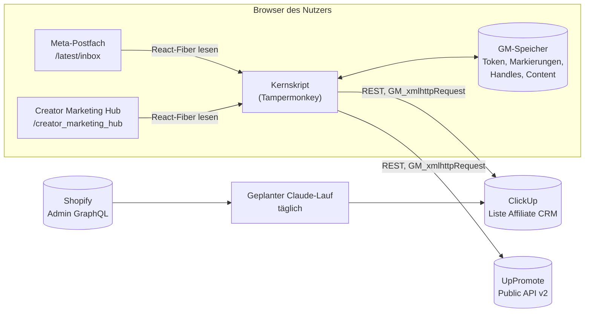
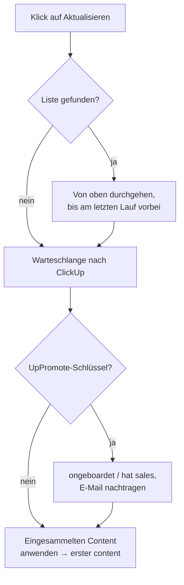

# Entwicklerdokumentation

Wie die Teile zusammenhängen, warum sie so gebaut sind, und wie man die
Umgebung aufsetzt.

Die Bedienung steht in [bedienung.md](bedienung.md).

---

## 1. Was das Ganze ist

Zwei Tampermonkey-Userscripts, die in der Meta Business Suite laufen und eine
Affiliate-Pipeline in ClickUp pflegen. Kein Server, keine Datenbank, keine
Erweiterung — alles passiert im Browser des Nutzers.

| Datei | Zweck |
|---|---|
| `postfach-markierungen.user.js` | Das Kernskript. Markierungen im Postfach, ClickUp-Anbindung, UpPromote, Content-Auswertung. |
| `creator-marketplace-links.user.js` | Blendet im Creator Marketplace eine Pille „zum Insta-Profil" ein. Eigenständig, kennt ClickUp nicht. |
| `postfach-lader.user.js` | **Zurückgestellt, nicht installieren.** Siehe Abschnitt 9. |

---

## 2. Verdrahtung



Der entscheidende Punkt: **Shopify hängt bewusst nicht am Skript.** Ein
Shopify-Admin-Token im Browser läse den kompletten Kundenstamm. Stattdessen
holt ein geplanter Claude-Lauf die Daten und schreibt sie nach ClickUp, mit
Zugängen, die ohnehin außerhalb des Browsers liegen.

---

## 3. Woher welches Signal kommt

| Signal | Quelle | Feld / Merkmal | Wer holt es |
|---|---|---|---|
| Unterhaltung, Titel, Datum | Meta-Postfach | React-Fiber, `thread` | Kernskript |
| Wer zuletzt schrieb | Meta-Postfach | Snippet beginnt mit `Du: ` | Kernskript |
| Instagram-Handle | Marketplace, Kontaktkarte, Vorschautext | Text | Kernskript |
| Onboarding | UpPromote | `GET /affiliates?status=active` | Kernskript |
| Sales | UpPromote | `approved_ + pending_ + paid_amount` | Kernskript |
| E-Mail des Affiliates | UpPromote | `email` | Kernskript |
| Nutzbarer Content | Creator Marketing Hub | React-Fiber, `content.ad_ready_status` | Kernskript |
| Warensendung | Shopify | Bestellung mit Tag `uppromote_gift` **oder** `Affiliate`, 0,00 € | Geplanter Lauf |
| Nachfass-Frist | abgeleitet | Versanddatum + 10 Wochentage | Geplanter Lauf |

### UpPromote

Basis `https://aff-api.uppromote.com/api/v2`, Schlüssel im Header
`Authorization`. 120 Anfragen pro Minute und Shop.

Es gibt **keinen Gifts-Endpunkt** — die Bereiche sind Programs, Affiliates,
Coupons, Payments, Referrals, Analytics, Webhooks. Warensendungen sind deshalb
nur über Shopify zu bekommen.

`upAktive()` blättert mit `per_page=100&page=N` und bricht ab, sobald eine Seite
dieselben Einträge liefert wie die vorige. Ohne diese Schranke lief die
Schleife bis zum Seitenlimit, falls UpPromote `page` ignoriert — einmal über
sechs Minuten ohne jedes Lebenszeichen.

### Creator Marketing Hub

Seite `/creator_marketing_hub/ad_content/`. Jede Kachel trägt am React-Fiber
ein `content`-Objekt. **Maßgeblich ist `ad_ready_status`, nicht
`pa_content_type`** — Berechtigung und Content-Art sind unabhängige Achsen, es
gibt UGC mit Rechten und Branded Content ohne.

| Metas Filter | `ad_ready_status` | Bedeutung |
|---|---|---|
| Für Anzeige bereit | `NO_ISSUES` | Rechte liegen vor |
| Handeln erforderlich | `WARNINGS` | keine Berechtigung, aber anfragbar |
| Unzulässig | nie beobachtet | nicht nutzbar |

Gezählt wird als **Positivliste** (`NO_ISSUES` oder `WARNINGS`), damit der
dritte Wert nie versehentlich mitzählt.

Zwei Parameter gehören zwingend in die Adresse:

- `sort_index=upac_publish_time` — ohne Datumssortierung zeigt Meta nach
  Relevanz vor allem fremde Creator
- `business_id` und `asset_id` — ohne sie landet Meta auf dem zuletzt
  benutzten Konto. Das Skript übernimmt beide aus der Adresse des Postfachs,
  statt sie fest zu verdrahten.

### Shopify

Warensendungen sehen in Shopify auf **zwei** Arten aus, je nach Zeitraum:

| Zeitraum | Tag | Entstehung |
|---|---|---|
| seit 06.08.2026 | `uppromote_gift` | UpPromote legt sie an, wenn der Affiliate sein Geschenk einlöst |
| davor, ca. 08.05.–02.09.2026 | `Affiliate` | von Hand als Entwurfsbestellung erfasst |

Beide haben Gesamtwert 0,00 €.

```graphql
orders(query: "tag:uppromote_gift OR tag:Affiliate") {
  name  createdAt  email  tags  displayFulfillmentStatus
  totalPriceSet { shopMoney { amount } }
}
```

Behalten wird nur, was **0,00 €** kostet und auf `FULFILLED` oder
`PARTIALLY_FULFILLED` steht — nur das ist wirklich raus. Bei mehreren
Bestellungen zu einer Adresse zählt die älteste. Zugeordnet wird
**ausschließlich über exakte E-Mail-Übereinstimmung**, nie über
Namensähnlichkeit.

#### Nachfass-Frist

Wo eine Warensendung erkannt wird, setzt der Lauf zugleich das **Fälligkeitsdatum**
des Tasks: Versanddatum **plus 10 Wochentage**, gezählt ab dem Tag nach dem
Versand, Samstag und Sonntag übersprungen, Feiertage unberücksichtigt. Das ist
die Deadline zum Nachhaken.

Kontrollbeispiel: Versand Freitag 31.07.2026 → Frist Freitag 14.08.2026.

**Nur, wenn der Task noch kein Fälligkeitsdatum hat.** Ein vorhandenes bleibt
unangetastet — es könnte von Hand gesetzt sein. Dieselbe Linie wie bei Status
und Priorität: was jemand selbst entschieden hat, überschreibt die Automatik
nicht.

Es gibt hier keine Kollision mit dem Skript: das schreibt `due_date` nur, wenn
jemand im Panel ein Datum einträgt, und liest es sonst aus ClickUp zurück. Die
Frist taucht dadurch von selbst in der „fällig"-Anzeige an der Pille auf.

> Die erste Fassung suchte nur nach `uppromote_gift` und übersah damit über
> hundert Altfälle aus der Handarbeits-Zeit — aufgefallen an einem Affiliate,
> dessen Paket nachweislich raus war und der trotzdem auf `ongeboardet` stand.
> Beim Erweitern solcher Filter lohnt die Gegenprobe ohne Filter.

---

## 4. Die Brücke zwischen den Welten

Jedes System kennt den Affiliate unter einem anderen Schlüssel:

```
Meta-Postfach ──── threadID
Marketplace ────── Bild-ID des Profilfotos
ClickUp ────────── Handle im Task-Namen  ("handle — Anzeigename")
UpPromote ──────── Handle  +  E-Mail
Shopify ────────── E-Mail
```

Verbunden wird über Markerzeilen in der **Task-Beschreibung**:

```
igfu-thread: <threadID>     Unterhaltung ↔ Task
igfu-bild:   <bildID>       im Marketplace erfasster Task ↔ Unterhaltung
igfu-mail:   <adresse>      Task ↔ Shopify-Bestellung
igfu-ware:   <JJJJ-MM-TT>   Versanddatum, vom geplanten Lauf gesetzt
```

**Warum Beschreibung und nicht Custom Fields:** Im ClickUp-Free-Plan sind 60
Custom-Field-Belegungen pro Workspace erlaubt, und die waren aufgebraucht. Die
Markerzeile kostet nichts, ist für Menschen lesbar und übersteht einen Export.

**Folge:** Ein Task ohne Handle im Namen ist von allen drei Automatiken
abgeschnitten — kein UpPromote-Treffer, also keine E-Mail, also keine
Warenzuordnung.

---

## 5. Die Statusleiter

```
 0 recherchiert
 1 angeschrieben
 2 kommunikation
 3 zugesagt
 4 ongeboardet              ← UpPromote: Affiliate ist aktiv
 5 erste ware versendet     ← Shopify: uppromote_gift, versendet
 6 erster content           ← Creator Marketing Hub: nutzbarer Content
 7 hat sales                ← UpPromote: Provision > 0

 8 abgesagt   9 keine antwort   10 beendet     ← für die Automatik tabu
```

**Regel: Automatik schiebt nur nach vorn.** Jeder automatische Statuswechsel
geht durch `darfSetzen(alt, neu)`.

Ohne diese Regel nehmen sich die Prüfungen gegenseitig das Ergebnis weg: der
UpPromote-Abgleich setzt jeden aktiven Affiliate auf `ongeboardet` und würde
`erste ware versendet` und `hat sales` bei jedem Lauf wieder einkassieren. Ein
Mutationstest reproduziert genau das, wenn man die Schranke entfernt.

Dieselbe Logik gilt für die Priorität `urgent`: sie wird **nur bei Status
`angeschrieben`** angefasst. Sobald jemand den Task von Hand einsortiert hat,
entscheidet er.

---

## 6. Der Aktualisieren-Lauf



**Gefiltert wird nach Aktualität, nicht nach Lesestatus.** Was man selbst
geschrieben hat, ist gelesen und würde bei einem Ungelesen-Filter durchrutschen.
Metas Liste ist streng nach Zeitstempel absteigend sortiert, und jede
Aktivität schiebt eine Unterhaltung nach oben — auch eine Antwort vom Handy.

Abgebrochen wird erst nach **drei Runden in Folge**, die ausschließlich
Älteres gebracht haben, mit einem Tag Puffer über den letzten Lauf hinaus. Der
allererste Lauf geht einmal komplett durch.

Fehlt die Liste, wird nur das Durchgehen übersprungen — Übertragung, UpPromote
und Content hängen nicht daran. Der Zeitstempel des letzten Laufs wird dann
aber **nicht** gesetzt, sonst überspränge der nächste Lauf alles dazwischen.

---

## 7. Technische Eigenheiten von Meta

**React-Fiber statt DOM.** Die Thread-IDs stehen nirgends im Markup. Sie hängen
am Fiber der Zeile:

```js
const key = Object.keys(row).find((k) => k.startsWith('__reactFiber$'));
// von dort nach oben, bis props.thread.threadID auftaucht
```

Deshalb `@sandbox JavaScript` im Metadatenblock — ohne das sieht das Skript
Metas Seitendaten nicht.

**Virtualisierte Liste.** Nur rund ein Dutzend Zeilen stehen gleichzeitig im
DOM. Was nicht sichtbar war, hat das Skript nie gesehen. Daher der
Durchlauf-Knopf.

**Jede Zeile steht doppelt** im DOM, muss also über die `threadID` entdoppelt
werden.

**Deep-Link.** Eine bestimmte Unterhaltung öffnet man mit

```
/latest/inbox/all/?partnership_messages=true
  &selected_item_id=<threadID>&thread_type=IG_MESSAGE
```

Ein eigenes URL-Fragment funktioniert **nicht**: Meta entfernt es binnen etwa
zwei Sekunden beim Laden, die Liste braucht aber rund fünf.

**`isFollowUp` am Thread-Objekt ist unbrauchbar** — das Feature ist bei Meta
kaputt. Die Follow-up-Markierung bleibt die eigene im GM-Speicher.

**`snippet` ist kein Text,** sondern ein React-Element. Der Text steht in
`snippet.props.children`, und eigene Nachrichten tragen davor `Du: `.

**Speicher.** Markierungen liegen im GM-Speicher, nicht in `localStorage` —
Meta räumt den Seitenspeicher beim Laden auf.

---

## 8. Einrichtung

### Tampermonkey

1. Tampermonkey in Chrome installieren.
2. In `chrome://extensions` unter Tampermonkey › Details prüfen:
   **„Allow user scripts"** an und **Websitezugriff auf allen Websites**.
   Ohne den ersten Schalter stehen Skripte im Dashboard auf aktiv und laufen
   trotzdem nie.
3. Die Rohadressen aufrufen und die Installation bestätigen:

```
.../main/postfach-markierungen.user.js
.../main/creator-marketplace-links.user.js
```

Beide tragen `@updateURL` und `@downloadURL`, aktualisieren sich also selbst.

> **Nie löschen und neu installieren.** Der GM-Speicher hängt an Name und
> Namespace; beim Löschen gehen Token und Markierungen mit.

### ClickUp

Liste mit genau diesen Status anlegen, in dieser Reihenfolge (Abschnitt 5).
Dazu ein Tag `follow-up`.

Im Skript-Panel eintragen:

- **Token** — ClickUp › Einstellungen › Apps › API-Token. Wer sich über Google
  anmeldet, muss vorher über „Passwort vergessen" ein lokales Passwort setzen,
  sonst gibt ClickUp keinen Token heraus.
- **Listen-ID** — steht in der Adresse der Liste.

Jeder Rechner und jede Person braucht eigene Werte; der GM-Speicher ist pro
Browser.

### UpPromote

Schlüssel aus UpPromote › Einstellungen › Integrationen, ebenfalls ins Panel.
Ab Professional-Plan.

### Geplanter Lauf für die Warensendungen

Läuft außerhalb des Browsers und braucht Zugriff auf Shopify und ClickUp. Er
ordnet nur über `igfu-mail` zu und rät nie über Namen.

> **Reihenfolge beim ersten Mal:** Skript installieren → einmal aktualisieren
> (dadurch bekommen die Tasks ihre `igfu-mail`-Zeile) → erst danach findet der
> Shopify-Lauf etwas.

---

## 9. Der Lader

`postfach-lader.user.js` sollte den Code bei jedem Seitenaufruf frisch aus dem
Repo holen. Er zeigt nach der Installation **gar keine Oberfläche**, Ursache
ungeklärt. CSP ist ausgeschlossen, `new Function` ist auf der Domain erlaubt.

**Die Falle:** Er trägt absichtlich denselben `@name` und `@namespace` wie das
Kernskript, damit der GM-Speicher erhalten bleibt. Im Dashboard heißt er
deshalb genauso und steht auf aktiv — zu unterscheiden **nur an der
Versionsnummer**. Seine `@updateURL` zeigt auf die Lader-Datei, er zieht also
nie auf eine neuere Kernversion nach.

Genau das ist einmal passiert: Lader installiert, im Postfach keine einzige
Pille, von außen sah alles normal aus. Die Suche lief lange über
Skript-Syntax, CSP und Chrome-Schalter — dabei war schlicht ein anderes Skript
installiert.

**Erste Diagnosefrage bei „keine Pillen": Versionsnummer im Dashboard.**

Vor einer Wiederbelebung braucht der Lader eine eigene Kennung und eine
bewusste Speicherübernahme.

---

## 10. Tests

```bash
node tests/postfach.test.mjs
node tests/lader.test.mjs
```

jsdom mit nachgebauten GM-Funktionen, ClickUp- und UpPromote-Antworten. Keine
echten Anfragen, keine echten Zugangsdaten.

**Gewohnheit: Mutationstest.** Nach jedem neuen Test die Zeile, die er absichern
soll, kurz kaputt machen und prüfen, dass der Test wirklich umfällt. Mehrere
Prüfungen liefen anfangs leer durch und hätten nichts gemerkt.

---

## 11. Regeln für Zugangsdaten

- Token liegen **ausschließlich** im GM-Speicher und werden bei jeder Anfrage
  frisch von dort gelesen.
- Niemals am `window`-Objekt, niemals im DOM, niemals in einer Fehlermeldung
  oder einem Log.
- Alle Anfragen über `GM_xmlhttpRequest` mit passendem `@connect`, nie über
  `fetch` — sonst greift Metas CSP, und der Token stünde im Seitenkontext.
- **Dieses Repo ist öffentlich.** Keine echten IDs, keine Namen, keine
  E-Mail-Adressen, keine Thread- oder Task-IDs in Code, Tests oder
  Commit-Nachrichten. Platzhalter in Beispielen sind frei erfunden.
